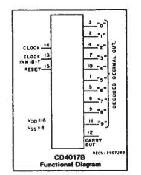

DIGITALIO_4017B_Graph
=====================

This little sketch shows the usage of the CD4017B Decade counter by controlling a LED Bar with a pushbutton
The 4017 is used to save pins on the arduino.
written by Fabian Morón Zirfas  
##based on work by
##[Leonel Machava](http://codentronix.com/2011/06/05/arduino-led-bar-graph-driven-by-a-4017-counter/)  
##[DojoDave & Tom Igoe](http://arduino.cc/en/Tutorial/Button)

  
  
  

-[CD4017B Datasheet](http://www.ti.com/lit/ds/symlink/cd4017b.pdf)  
__Pin Functions CD4017B__  

- PIN 16 - V DC
- PIN 15 - RESET
- PIN 14 - CLOCK
- PIN 13 - CLOCK INHIBIT (STOP COUNTING)
- PIN 12 - CARRY OUT (INDICATE DECIMAL)
- PIN 11 - 9
- PIN 10 - 4
- PIN 09 - 8
- PIN 08 - GND
- PIN 07 - 3
- PIN 06 - 7
- PIN 05 - 6
- PIN 04 - 2
- PIN 03 - 0
- PIN 02 - 1
- PIN 01 - 5

##License  
This code is release under the "MIT License" available at  
http://www.opensource.org/licenses/mit-license.php