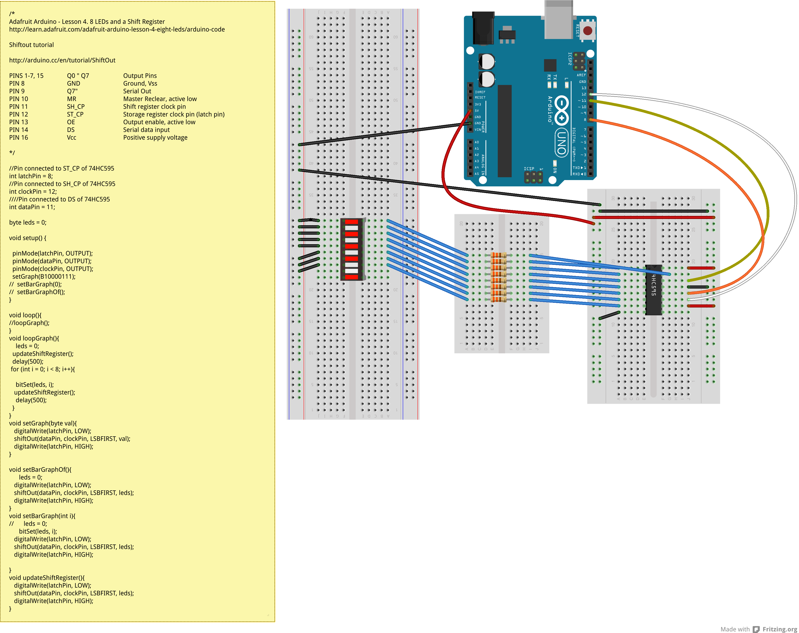

DIGITALIO_74HC595_Graph
=======================

Controlling a [LED Bargraph](https://www.sparkfun.com/products/9937) with a [74HC595 Shiftregister](https://www.sparkfun.com/datasheets/IC/SN74HC595.pdf)

  
written by Fabian Morón Zirfas  
based on  

Adafruit Arduino - Lesson 4. 8 LEDs and a Shift Register  
[http://learn.adafruit.com/adafruit-arduino-lesson-4-eight-leds/arduino-code](http://learn.adafruit.com/adafruit-arduino-lesson-4-eight-leds/arduino-code)  
  
Shiftout tutorial  
[http://arduino.cc/en/tutorial/ShiftOut](http://arduino.cc/en/tutorial/ShiftOut)  

- PINS 1-7, 15     Q0 " Q7     Output Pins  
- PIN 8    GND     Ground, Vss  
- PIN 9    Q7"     Serial Out  
- PIN 10   MR  Master Reclear, active low  
- PIN 11   SH_CP   Shift register clock pin  
- PIN 12   ST_CP   Storage register clock pin (latch pin)  
- PIN 13   OE  Output enable, active low  
- PIN 14   DS  Serial data input  
- PIN 16   Vcc     Positive supply voltage   

##License

Copyright (c)  2013 Fabian "fabiantheblind" Morón Zirfas  
Permission is hereby granted, free of charge, to any person obtaining a copy of this software and associated documentation files (the "Software"), to deal in the Software  without restriction, including without limitation the rights to use, copy, modify, merge, publish, distribute, sublicense, and/or sell copies of the Software, and to  permit persons to whom the Software is furnished to do so, subject to the following conditions:  
The above copyright notice and this permission notice shall be included in all copies or substantial portions of the Software.  
THE SOFTWARE IS PROVIDED "AS IS", WITHOUT WARRANTY OF ANY KIND, EXPRESS OR IMPLIED, INCLUDING BUT NOT LIMITED TO THE WARRANTIES OF MERCHANTABILITY, FITNESS FOR A  PARTICULAR PURPOSE AND NONINFRINGEMENT. IN NO EVENT SHALL THE AUTHORS OR COPYRIGHT HOLDERS BE LIABLE FOR ANY CLAIM, DAMAGES OR OTHER LIABILITY, WHETHER IN AN ACTION OF  CONTRACT, TORT OR OTHERWISE, ARISING FROM, OUT OF OR IN CONNECTION WITH THE SOFTWARE OR THE USE OR OTHER DEALINGS IN THE SOFTWARE.  

see also [http://www.opensource.org/licenses/mit-license.php](http://www.opensource.org/licenses/mit-license.php)  

##Some Links  
[Cain Shiftregisters](http://www.protostack.com/blog/2010/05/introduction-to-74hc595-shift-register-controlling-16-leds/)  
[https://www.sparkfun.com/products/9519](https://www.sparkfun.com/products/9519)  
[http://arduino.cc/en/tutorial/ShiftOut](http://arduino.cc/en/tutorial/ShiftOut)  
[file:///Applications/Arduino.app/Contents/Resources/Java/reference/ByteCast.html](file:///Applications/Arduino.app/Contents/Resources/Java/reference/ByteCast.html)  
http://learn.adafruit.com/adafruit-arduino-lesson-4-eight-leds/overview  
[https://www.sparkfun.com/datasheets/IC/SN74HC595.pdf](https://www.sparkfun.com/datasheets/IC/SN74HC595.pdf)  