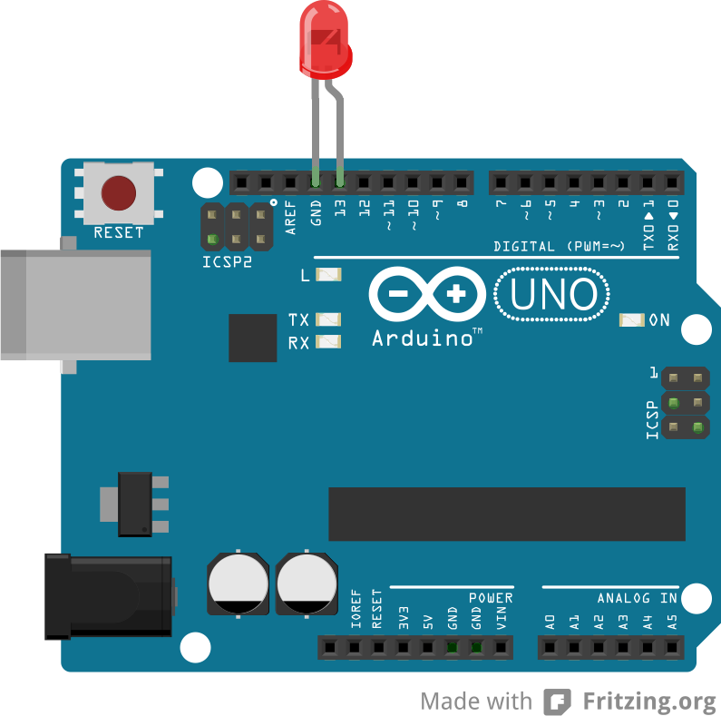
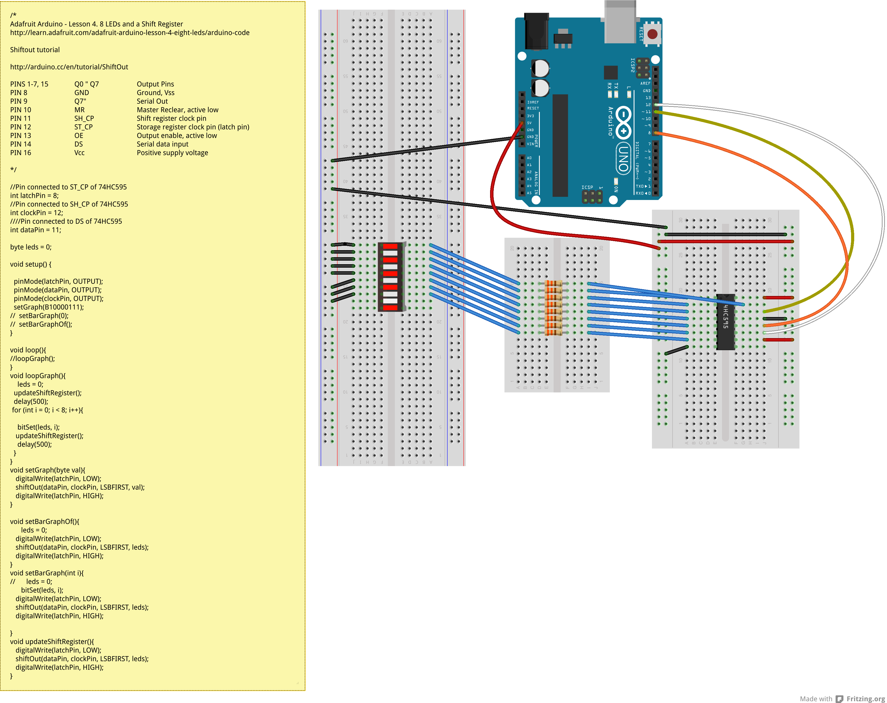
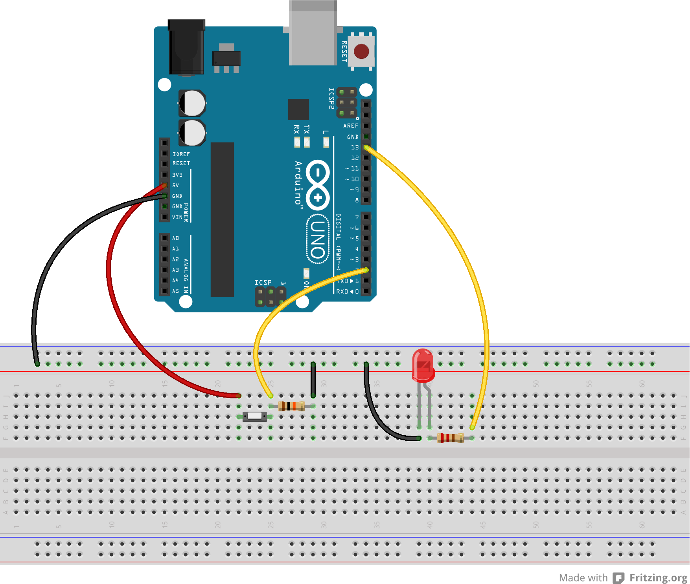
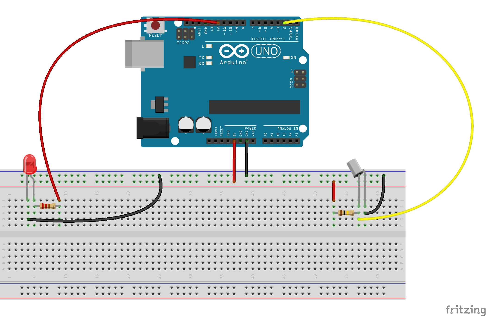

digitalio
=========

These sketches are part of the course ["Eingabe, Ausgabe. Grundlagen der prozessorientierten Gestaltung"](https://incom.org/workspace/4693) by Monika Hoinkis

##blink
  
##IC_74HC595_Graph
  
##IC_4017B_Graph
  
##IC_4017B_Graph_PushDetect
  
##pushbutton
  
##tiltswitch
  

